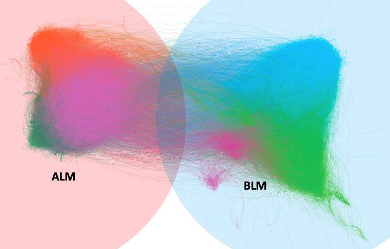
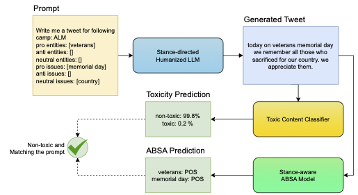

# Towards a Programmable Humanizing AI through Scalable Stance-Directed Architecture

Welcome to the **Stance-Directed Humanizing AI** repository. The proposed pipeline aims to reduce the generation of toxic narratives in digital communications by leveraging the power of generative artificial intelligence (AI) fine-tuned on positive human values. Our approach emphasizes the importance of fostering social cohesion and understanding through language, counteracting the spread of harmful content online.


This study introduces a novel pipeline to train Large Language Models (LLM) for generating tweets that are not only relevant to given aspects and entities but also aligned with healthier discourse and constructive sentiments. This pipeline utilizes a toxic content classifier to ensure generated tweets are non-toxic and employs a stance-aware aspect-based sentiment analysis (ABSA) model to extract stances from these tweets, promoting a more civil and humanized interaction on social media platforms where it is demonstrated on contentious real-world Twitter dataset on U.S. race relations.

<p align="center"></p>

## Key Components
<p align="center"></p>

1. **[Stance-Directed Tweet Generator](https://huggingface.co/tweetpie/stance-directed-tweet-generator)**: Based on aspects and entities, this model generates tweets that aim to reflect humanized and constructive discourse.
2. **[Toxic Content Classifier](https://huggingface.co/tweetpie/toxic-content-detector)**: This component classifies the generated tweets as toxic or non-toxic, ensuring the promotion of positive engagement.
3. **[Stance-Aware ABSA Model](https://huggingface.co/tweetpie/stance-aware-absa)**: Extracts the stance of the generated tweet towards the specified aspects and entities, facilitating a deep understanding of sentiments.

## Datasets

The study incorporates five datasets:
- **[TrainTweetsForHumanizedLLM.csv](data/TrainTweetsForHumanizedLLM.csv)** and **[TrainTweetsForUnrestrictedLLM.csv](data/TrainTweetsForUnrestrictedLLM.csv)**: Training data for humanized and unrestricted LLMs respectively.
- **[ToxicClassifierDataset.csv](data/ToxicClassifierDataset.csv)**: Training data for the toxic content classifier.
- **[GoldToxicDataset.csv](data/GoldToxicDataset.csv)**: Golden outputs for evaluating the toxicity classifier's performance, labelled by 3 annotators with a Krippendorff's alpha nominal score of 0.73, indicating a good level of inter-annotator agreement.
- **[GeneratedOutputsWithLabels.csv](data/GeneratedOutputsWithLabes.csv)**: The generated tweets using humanized and unrestricted LLMs labelled by 3 annotators and provided with classifier model predictions, indicating a Krippendorff's alpha nominal score of 0.75, further showing a reliable consensus among annotators.
- **[UserIDwithCommunityLabels.csv](data/UserIDwithCommunityLabels.csv)**: User IDs and their assigned community labels.
- **[GeneratedOutputsWithLabes.csv](data/GeneratedOutputsWithLabes.csv)**: The relatedness and toxicity results of the Humanized LLM, ChatGPT 4o, Gemini, Claude, and Mistral Large models on equally balanced left and right ideology prompts.

## Using This Repository

To simulate our study and see the models in action:

1. **Select Camp, Aspects, and Entities**: Begin by specifying the camp along with the aspects and entities you are interested in.
2. **Generate a Tweet**: The tweet generator model will produce a tweet based on your input.
3. **View ABSA Outputs**: Analyze the fine-grained sentiments and stances extracted from the generated tweet.
4. **Toxic/Non-Toxic Label**: Determine whether the generated tweet is considered toxic or non-toxic.

### How to Run the App on Huggingface Space or Locally
The study is available as a Huggingface Space and can be accessed [here](https://huggingface.co/spaces/tweetpie/stance-directed-humanizing-ai).

To run the app locally, you can use the following command:

```bash
git clone https://huggingface.co/spaces/tweetpie/stance-directed-humanizing-ai
cd stance-directed-humanizing-ai
pip install -r requirements.txt

streamlit run app.py
```

```plaintext
Sample input/output:

Ideology: Left
Pro Entities: ['migrant worker rights groups']
Anti Entities: ['labor exploitation']
Neutral Entities: ['agricultural sector']
Pro Aspects: ['fair treatment', 'safety standards']
Anti Aspects: []
Neutral Aspects: ['employment laws', 'worker visas']

Generated Tweet: "the agricultural sector is the single biggest recipient of migrants workers rights groups argue . nearly 90 % of those who come to the us are denied employment due to discriminatory employment laws and safety standards ."
ABSA Outputs:
    Aspect: migrants, Sentiment: positive
    Aspect: rights, Sentiment: positive
    Aspect: laws, Sentiment: positive
    Aspect: safety, Sentiment: positive 
Toxic/Non-Toxic Label: Non-Toxic
```

## Contributions and Feedback

We encourage contributions and feedback to improve this project. If you have suggestions or want to contribute, 
please open an issue or pull request on our GitHub repository.

## Citation

If you use our work, please cite our paper:

```bibtex
@article{ccetinkaya2024towards,
  title={Towards a Programmable Humanizing AI through Scalable Stance-Directed Architecture},
  author={{\c{C}}etinkaya, Yusuf M{\"u}cahit and Lee, Yeonjung and K{\"u}lah, Emre and Toroslu, {\.I}smail Hakk{\i} and Cowan, Michael A. and Davulcu, Hasan},
  journal={},
  year={2024},
  volume={}
}
```

